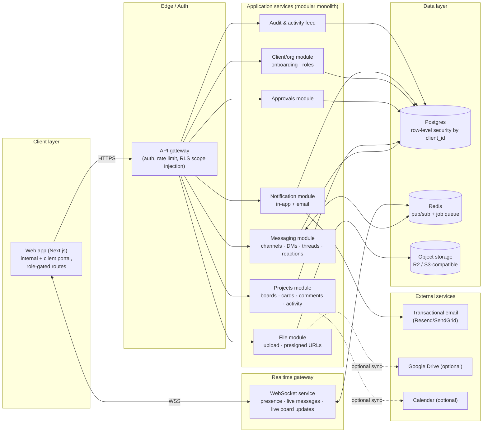

# Vanguard Platform — Product & Architecture Spec

Internal communication + client project management system, replacing Slack and
formalizing project/approval tracking for client work. Prepared as a
pre-build reference: scope, data model, workflows, and phased delivery plan.

---

## 1. Product Spec (concise)

**What it is:** one app with two faces — an internal workspace (chat, channels,
boards, admin) and a client portal (their projects, files, approvals) — backed
by the same database and permission model, so nothing has to be synced or
duplicated between "the chat tool" and "the project tool."

**What it replaces:** Slack (chat/channels/DMs/search) and ad hoc use of
Trello/email/Drive links for client-facing status and approvals.

**What it is not, at launch:** a video calling app, a generic enterprise
suite, a fully automated workflow engine, or a public Trello clone. Keep it
narrow and fast rather than broad and slow.

**Primary users:**
- **Internal team** (admins, PMs, team members) — live in chat + boards all day.
- **Clients** — log in occasionally to review status, comment, and approve.

**Success looks like:** the team stops paying for Slack, every client
deliverable has one traceable approval trail, and clients stop needing an
email thread or a Trello guest seat to know what's going on.

---

## 2. Architecture Overview

**Shape:** a modular monolith, not microservices. A five-person agency does
not need service-mesh operational overhead — it needs one deployable backend,
one Postgres database, and clean internal module boundaries so it *could*
split later if it must. Split out only the realtime layer, because chat
fan-out has different scaling characteristics than CRUD.

**Why this shape:**
- One Postgres database with `client_id` scoping everywhere means the
  internal/client boundary is enforced in **one place** (query layer + row
  security), not re-implemented per feature.
- Redis pub/sub bridges the WebSocket gateway to the app modules so chat
  messages and board updates broadcast without every module owning its own
  socket logic.
- Everything client-facing (files, approvals, email) funnels through the
  same audit log, so "who approved what, when" is never reconstructed after
  the fact from Slack scrollback.

---

## 3. Data Model Outline

Core entities (Postgres). Every client-scoped table carries `client_id` for
row-level security, even where it's reachable via a join — it's what makes
access control auditable and fast to reason about.

| Table | Key columns | Notes |
|---|---|---|
| `users` | id, name, email, password/auth id, `global_role`, avatar, status | `global_role`: admin / team_member / pm / client. |
| `clients` | id, name, logo, status, created_at | One row per client company. |
| `client_members` | client_id, user_id, `client_role` | client_admin / client_collaborator. Join table — a client can have several contacts. |
| `projects` | id, client_id, name, status, owner_id (PM), created_at, archived_at | |
| `boards` | id, project_id, name | Usually 1:1 with project. |
| `board_columns` | id, board_id, name, position, `is_client_visible`, `maps_to_status` | Lets internal-only columns (e.g. "Internal QA") exist without clients seeing them. |
| `cards` | id, board_id, column_id, title, description, priority, due_date, assignee_id, created_by, position, `approval_state`, created_at, updated_at | approval_state: none / pending / approved / changes_requested. |
| `card_comments` | id, card_id, author_id, body, `is_internal`, created_at | `is_internal` is the enforcement point for hiding internal chatter from clients — checked server-side, never trusted from the client. |
| `card_attachments` | card_id, file_id | |
| `card_activity` | id, card_id, actor_id, action_type, from_value, to_value, created_at | Feeds the timeline; append-only. |
| `approvals` | id, card_id, requested_by, requested_at, decided_by, decision, decided_at, notes | One row per approval round-trip. |
| `channels` | id, `type`, name, client_id (nullable), project_id (nullable), is_private, created_by | type: department / client / project / dm / group. |
| `channel_members` | channel_id, user_id, role, last_read_at | `last_read_at` drives unread counts. |
| `messages` | id, channel_id, sender_id, body, `parent_message_id`, created_at, edited_at, deleted_at | `parent_message_id` implements threads. |
| `reactions` | message_id, user_id, emoji | |
| `mentions` | message_id, mentioned_user_id | Drives notifications, kept denormalized for fast lookups. |
| `files` | id, uploaded_by, filename, storage_key, size, mime_type, source, created_at | source: native / gdrive. |
| `notifications` | id, user_id, type, entity_ref, read_at, created_at | |
| `audit_logs` | id, actor_id, action, entity_type, entity_id, metadata (jsonb), ip, created_at | Append-only, never updated or deleted. |
| `integrations` | id, type, client_id/project_id, config (jsonb), connected_by | Google Drive / calendar connections. |

**Design calls worth flagging:**
- `is_internal` on comments (not a separate table) keeps one comment thread
  per card instead of two parallel ones that drift out of sync.
- `approval_state` lives on the card, `approvals` holds the history — so "is
  this approved right now" is a single indexed column, not a derived query.
- The activity feed is **not** a separate hand-maintained table; it's
  computed from `card_activity` + `messages` + `approvals` at read time,
  filtered by client/project/person. Denormalize into a feed table only if
  that query gets slow in practice.

---

## 4. Roles & Permissions

| Role | Scope | Can |
|---|---|---|
| **Admin** | Global | Everything: billing, user management, all clients/projects, audit log access. |
| **Project Manager** | Assigned clients/projects | Create projects/boards, manage client onboarding, control approvals, everything a Team Member can do. |
| **Team Member** | Assigned channels/projects | Chat, comment, update cards, upload files — no user or client management. |
| **Client Admin** | One client, all that client's projects | View, comment, approve, invite other client contacts. |
| **Client Collaborator** | One client, specific projects only | View, comment, approve — scoped narrower than Client Admin. |

**Enforcement principle:** role checks happen in the query/API layer, not
just hidden in the UI. A client session should get a 403 (not just a
missing button) if it ever calls an internal-only endpoint — assume someone
will eventually poke the network tab.

---

## 5. Core Workflows

**Team chat.** Message posted → written to `messages` → broadcast over the
channel's WebSocket room → `mentions` extracted and turned into
notifications → sender's `channel_members.last_read_at` advances, everyone
else's unread count increments.

**Project creation.** PM creates a project under a client → board
auto-provisioned with default columns (To Do / In Progress / Waiting on
Client / Approved / Done) → matching project channel auto-created → team
assigned → relevant client contacts get portal access scoped to that
project only.

**Client onboarding.** Admin/PM creates the client record → invites the
primary contact via a signed, single-use, expiring link → contact sets a
password → `client_members` row created scoped to specific projects →
`audit_logs` entry written → client portal now shows exactly (and only)
their projects.

**Task approval.** PM moves a card to "Waiting on Client" → `approvals` row
created, client notified (in-app + email) → client opens the card in the
portal view (internal-only comments and columns are filtered server-side,
not just hidden in CSS) → client approves or requests changes with a
comment → card moves to Approved or back to In Progress → activity feed and
audit log updated → project channel gets a system message.

**Client dashboard updates.** Portal subscribes (scoped by `client_id`) to
their projects' activity → shows project list, pending-approval queue, and
filtered activity feed → client comments write to `card_comments` with
`is_internal = false` → notifications fire for new tasks awaiting approval,
new files, and replies to their comments.

---

## 6. Frontend Pages & Navigation

**Internal app** (left rail: Home · Chat · Projects · Clients · Search ·
Admin, role-gated):

- `/home` — unified inbox: unread channels + assigned cards + pending approvals
- `/chat`, `/chat/[channelId]` — channel list (departments, clients, projects, DMs)
- `/projects`, `/projects/[id]/board`, `/projects/[id]/activity`
- `/clients`, `/clients/[id]`, `/clients/[id]/onboarding`
- `/search` — messages, cards, files, people in one box
- `/admin` — users, roles, audit log, integrations
- `/settings` — profile, notification preferences

**Client portal** (simplified top nav: Overview · Projects · Approvals ·
Files), same app, gated routes rather than a separate codebase:

- `/portal/home` — their projects + a pending-approvals banner up top
- `/portal/projects/[id]/board` — client-safe board (internal columns/comments filtered)
- `/portal/approvals` — queue of everything waiting on their decision
- `/portal/projects/[id]/files`
- `/portal/activity` — their filtered feed

---

## 7. Backend Services & APIs

Modules within the monolith (see architecture diagram), each owning its
tables and exposing typed APIs (tRPC or REST — tRPC recommended for a small
TypeScript team, it removes an entire class of "API contract drifted"
bugs):

- **Auth** — login, invites, sessions, (SSO later)
- **Messaging** — channels, messages, threads, reactions, presence
- **Projects/Boards** — projects, cards, comments, activity
- **Approvals** — request/decision lifecycle, tied into notifications
- **Client/Org** — client records, client_members, onboarding
- **Notifications** — in-app + email, digest jobs (BullMQ + Redis)
- **Files** — presigned upload/download URLs, optional Drive sync
- **Audit/Activity** — immutable log writes, feed queries
- **Search** — Postgres full-text search (`tsvector`) for MVP; swap for
  Meilisearch/Typesense only if latency demands it

Realtime (chat, live board moves, presence) rides a separate WebSocket
gateway process, decoupled from the API via Redis pub/sub, so the request/
response API can be scaled or redeployed independently of live connections.

---

## 8. Security Requirements for Client Data

- **Row-level scoping everywhere.** Every client-facing query filters by
  `client_id` membership in a shared query layer — never assembled ad hoc
  per endpoint.
- **Server-side enforcement of `is_internal`.** Internal comments/columns
  are filtered in the API response, not hidden with CSS — a client account
  must never receive the bytes.
- **IDOR testing.** Explicitly test that a client account cannot enumerate
  another client's project/card/file IDs.
- **Invite links** are single-use and expire; **client sessions** carry
  scope claims that internal-only endpoints reject outright.
- **Audit log** (append-only) covers: logins, role changes, client
  onboarding, approval decisions, file downloads, permission changes.
- **Files** served via short-lived presigned URLs, not public buckets.
- **Transport/at-rest encryption** via a managed Postgres provider (TLS +
  encryption at rest out of the box).
- **2FA** at least for Admin/PM roles.
- **Backups** of database and file storage, with a tested restore — not
  just a cron job nobody has verified.

---

## 9. Tech Stack

Optimized for a small team that has to operate this themselves, not for
maximum theoretical scale.

| Layer | Choice | Why |
|---|---|---|
| Frontend | Next.js + TypeScript + Tailwind + shadcn/ui | One codebase for internal app and client portal, gated by role/route. |
| API | tRPC on Node (or REST if the team prefers) | End-to-end types, fast to build and refactor solo/small-team. |
| Realtime | Socket.io gateway, or a managed realtime layer (Supabase Realtime/Ably) | Managed realtime removes an entire ops burden if budget allows; self-hosted Socket.io is fine at this scale otherwise. |
| Database | Postgres (managed: Supabase, RDS, or Neon) | Full-text search, JSONB, and row-level security built in — no need for a separate search engine or document store at MVP. |
| Queue/cache | Redis (BullMQ for jobs, pub/sub for realtime) | |
| File storage | Cloudflare R2 (S3-compatible, no egress fees) | Cheaper than S3 at agency file-sharing volumes. |
| Email | Resend or SendGrid | Transactional notifications, approval alerts. |
| Hosting | Railway, Render, or Fly.io | Cost-effective managed deploys; avoid hand-rolled Kubernetes for a team this size. |
| Auth | Own auth (email/password + invite links) or Clerk/Supabase Auth | Buy this if it saves meaningful build time; it's not the differentiated part of the product. |

---

## 10. Build vs. Integrate: Trello

**Recommendation: build a native, lightweight Kanban board. Do not
integrate Trello.**

Reasoning:
- **Approvals are the differentiator, and Trello has no native concept of
  them.** Bolting an approval workflow onto Trello means Power-Ups, custom
  fields, and Butler automations glued together — fragile, and still real
  engineering work, just work spent fighting someone else's data model
  instead of owning it.
- **The internal/client visibility boundary (`is_internal`) doesn't exist in
  Trello.** There's no clean way to show a client a card while hiding
  specific internal comments — you'd need a sync/mirror layer, which is
  more complexity than a plain Kanban table with a boolean column.
- **It doesn't reduce the SaaS-dependency problem you're solving for.** The
  whole premise here is cutting a recurring subscription; anchoring the
  MVP on another vendor's API (and its rate limits, auth flows, and
  eventual pricing changes) undermines that.
- **A basic Kanban is genuinely small to build.** Columns, cards,
  drag-and-drop (dnd-kit or similar), comments, and activity history is a
  few days of work, not a few weeks — nowhere near the cost of a two-way
  Trello sync layer done properly.

**Where Trello still helps:** a one-time import script (pull boards/cards
via the Trello API to seed the new system) for teams with existing Trello
history — not live sync.

---

## 11. Phased Build Plan

| Phase | Scope | Duration |
|---|---|---|
| **0 — Foundation** | Repo scaffold, auth, roles, DB schema v1, deploy pipeline | ~1 week |
| **1 — MVP** | Channels, DMs, threads, mentions, reactions, file share, basic search; native Kanban per project; client onboarding + portal (view/comment/approve); activity feed; audit log; email notifications | ~4–6 weeks |
| **2 — Depth** | Due-date/calendar views, Google Drive integration, digest emails, upgraded search (Meilisearch if needed), presence/typing indicators, mobile-responsive polish, admin analytics (overdue tasks, client health) | ~4 weeks |
| **3 — Later** | SSO/SAML for larger clients, automation/rules engine, reporting exports, native mobile/push, Trello one-time import tool | Ongoing, as demand appears |

Phase 1 is the line where Slack becomes safely cancellable — don't ship
Phase 2 features before that bar is cleared.

---

## 12. Key Risks & Tradeoffs

- **Realtime infra complexity.** Hand-rolled WebSocket clustering is the
  easiest place to over-engineer. Prefer a managed realtime provider unless
  there's a strong reason to self-host.
- **Adoption risk.** People are attached to Slack's muscle memory. Mitigate
  with fast search, real keyboard shortcuts, and running both systems in
  parallel for ~2 weeks rather than a hard cutover.
- **Client trust is now infrastructure-dependent.** Downtime or a bug in
  the approval flow is now a client-facing incident, not an internal
  inconvenience. Budget real test coverage on the approval path before
  external launch, and stand up a staging environment first.
- **Scope creep.** Chat + PM tool is two products' worth of ambition.
  Phase discipline (section 11) is the main defense against the timeline
  doubling.
- **Security surface.** Mixing internal secrets and client-facing data in
  one system raises the stakes of any permission bug. Row-level scoping and
  IDOR tests need to exist from day one, not get bolted on before launch.
- **Small team, managed ops.** Favor Supabase/Railway/Resend-style managed
  services over anything that needs its own on-call rotation.

---

## 13. First Sprint Tasks

1. Monorepo scaffold (Next.js + API layer), CI, staging deploy.
2. Auth: email/password + sessions, role enum, seed an admin user.
3. Schema v1: `users`, `clients`, `client_members`, `channels`,
   `channel_members`, `messages`.
4. Chat MVP: channel list + send/receive, one department channel working
   end-to-end (even if realtime is just polling at first).
5. Boards schema + basic Kanban UI (columns, create card, drag between
   columns) for one real test project.
6. Client invite flow skeleton: create client → generate invite link →
   client sets password.
7. `audit_logs` table, writing on login and role-change events.
8. Deploy a demo build for internal team feedback before Phase 1 continues.
